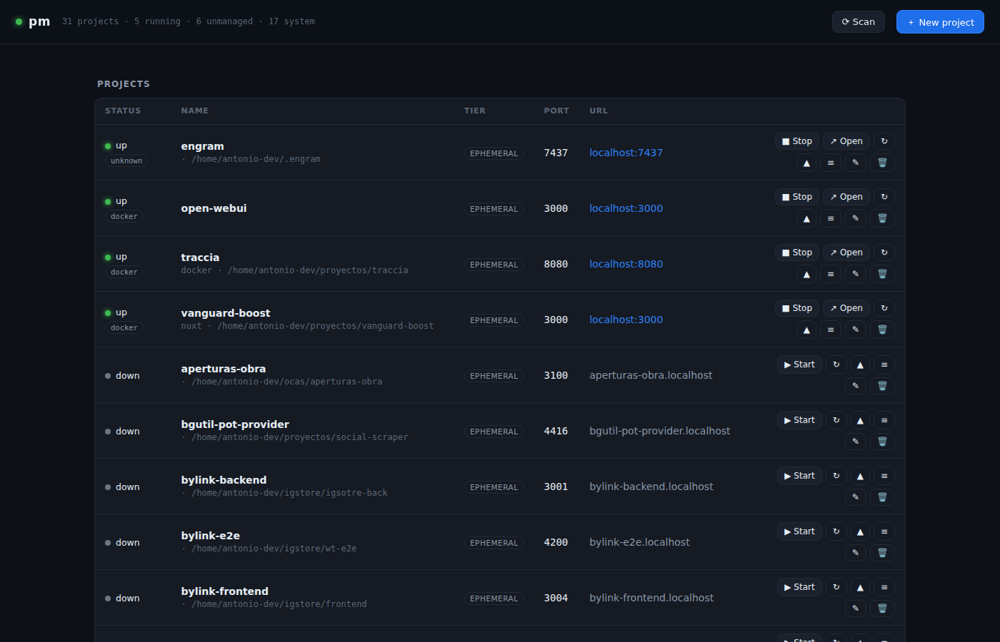

# pm — local project & port manager

[](LICENSE)
[](go.mod)
[](https://github.com/antoniojosev/pm/releases)

A single Go binary that knows **what runs on which port**, lets you **start/stop** projects from any stack, gives them a **name in the browser** (`<project>.localhost`), and exposes everything over **CLI**, **web dashboard**, **HTTP API** and an **MCP server** so coding agents can manage your dev servers too.

Built for WSL2 + systemd + Chrome.



## Core idea

- **Launch anything with a prefix**: `pm run -- npm run dev`. pm puts it inside a *systemd unit* (`pm-<project>.service`) with the `PM_PROJECT` env var, so it can **attribute** the process and **kill its whole tree** when you stop it.
- **Detects the real system state** with `ss` + `/proc` (cwd, cgroup, cmdline) + `docker ps`. It even sees what you started outside of pm (it shows up as *unmanaged* and you adopt it).
- **Discovers the port on its own**: it looks at what the cgroup binds; no need to declare it.
- **Collision → next port**: if the preferred port is taken, it reassigns to the next free one and injects the port according to the stack (`--port` in Vite, `-p` in Next, `PORT=` env, `0.0.0.0:{port}` in Django…).
- **`.localhost` names**: Caddy on `:80` routes `myapp.localhost` → the real live port. The config regenerates itself from state.
- **Tiers**: `ephemeral` (transient unit) ↔ `service` (user unit, starts at boot). Toggle with `promote`/`demote`.

## Install

```bash
make install                # builds and copies the binary to ~/.local/bin/pm
pm setup                    # prepares ~/.pm, Caddyfile and systemd units
pm doctor                   # checks the environment
# install Caddy if missing:  sudo apt install -y caddy
systemctl --user enable --now pm-daemon pm-caddy
```

`./scripts/install.sh` does the same as `make install`. From **Windows**: copy `scripts/pm.cmd` into a folder on your PATH → `pm ps`, `pm ui`, etc. forward to WSL.

## CLI

```
pm run -- <cmd>        launches the cwd (auto-registers, detects port, marks it)
pm ps                  list running projects (add -a to include stopped)
pm start|stop|restart <name>
pm promote|demote <name>       ephemeral ↔ permanent service
pm up|down <group>             bring a group up/down
pm add|edit|rm <name>          registry CRUD
pm claim <port>                adopt an 'unmanaged' listener
pm scan                        discover projects under the roots (PM_ROOTS)
pm listen                      ports on the machine that pm doesn't manage
pm logs <name> [-f]            logs (stream with -f)
pm open <name> | pm ui         open in the browser
pm serve                       start the daemon (API + web + SSE + MCP)
pm doctor | pm setup
```

## Web

`http://pm.localhost` (or `pm ui`). Live dashboard (SSE): status, start/stop, promote/demote, streaming logs, adopt unmanaged listeners, groups and full CRUD.

## MCP

The daemon exposes MCP over HTTP at `/mcp`. Add it to your `.mcp.json`:

```json
{ "mcpServers": { "pm": { "type": "http", "url": "http://127.0.0.1:9797/mcp" } } }
```

Tools (mirror of the CLI): `pm_list`, `pm_start`, `pm_stop`, `pm_restart`, `pm_promote`, `pm_demote`, `pm_register`, `pm_remove`, `pm_claim`, `pm_scan`, `pm_logs`, `pm_group_up`, `pm_group_down`.

## Config

| Variable           | Default                 | Meaning                                                              |
| ------------------ | ----------------------- | -------------------------------------------------------------------- |
| `PM_HOME`          | `~/.pm`                 | Runtime root: registry, logs, Caddyfile.                             |
| `PM_ROOTS`         | `~/projects`            | Folders `pm scan` walks (one level deep), separated by `:`.          |
| `PM_DAEMON_URL`    | `http://127.0.0.1:9797` | Where the CLI/web look for the daemon.                               |
| `PM_REMOTE_SUFFIX` | `.pm`                   | Extra DNS suffix routed by Caddy (e.g. via Tailscale). `off` disables. |
| `PM_NO_PROXY`      | unset                   | `1` stops the daemon from managing the Caddyfile (secondary daemons, tests). |

## Development

```bash
make build     # ./pm with the git version stamped in
make test      # go test -race ./...
make vet       # go vet + gofmt check
make cover     # per-package coverage
```

Tests run fully isolated: temp `PM_HOME`, injected live state, and `systemctl` / `systemd-run` / `docker` replaced by fakes, so they never touch a real daemon or `~/.pm`.

## Architecture

```
cmd/pm            entrypoint
internal/
  config          paths and constants
  registry        persistent catalog (JSON)
  detector        real state: ss + /proc + docker
  scan            stack detection / auto-registration
  runner          systemd units, ports, collision, tiers, groups
  proxy           generates Caddyfile + reload
  daemon          HTTP API + SSE + embedded web + proxy reconciliation
  api             shared service layer (CLI + daemon + MCP)
  mcp             MCP server (streamable HTTP)
  cli             cobra commands
  webui           embedded dashboard (go:embed)
```

One core, four faces: CLI, Web, HTTP API and MCP all share `internal/api`.

The web dashboard is a single dependency-free HTML file (`internal/webui/dist/index.html`) embedded in the binary with `go:embed`. There is no frontend build step: edit the file, `make build`, done.

## Alternatives

| Tool | What it does | What pm adds |
| --- | --- | --- |
| [overmind](https://github.com/DarthSim/overmind) / [foreman](https://github.com/ddollar/foreman) | Run the processes of **one** `Procfile` in a tmux session / foreground. | pm is machine-wide: every project on the box, each in its own systemd unit that survives the terminal, plus discovery of processes it did not start. |
| [portless](https://github.com/vercel-labs/portless) | Gives Node dev servers a `*.localhost` name instead of a port. | pm names any stack (Node, Django, Go, Flutter, docker-compose…), resolves port collisions by itself, and keeps Caddy in sync from live state rather than from a wrapper. |
| [devbox](https://github.com/jetify-com/devbox) | Reproducible per-project dev environments (Nix) with `devbox services`. | pm does not manage toolchains at all; it manages what is *running*: ports by name, `.localhost` routing, an MCP server for agents, and systemd scopes for clean process trees. They compose fine. |

In short, pm is the piece that answers "what is running, on which port, and how do I reach it by name" for a whole machine, and exposes that to humans (CLI/web) and agents (MCP) alike.

## License

[MIT](LICENSE) © Antonio Vila
